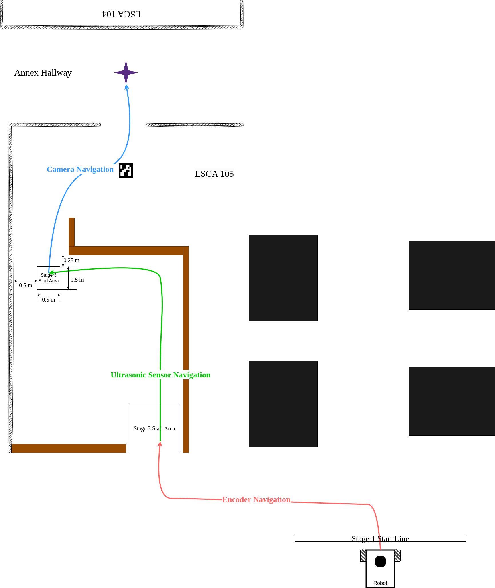

# Final Project: Multi-Sensor Navigation

## Background
Robotic navigation is all about moving a robot from a location, A to another location, B. Navigation is an essential functionality for any mobile robot (e.g. [Warthog](https://youtu.be/GAveEaNZZZE?si=BLWMSZ36F_Ti4tfm), [Roomba](https://youtu.be/CvZTF6YNZUw?si=JsgiMpYMYitBodM5), [Proteus](https://youtu.be/LUnZXBL_lqA?si=6UPZwneYxQJavZvq), [custom robot](https://youtu.be/jkoGkAd0GYk?si=mJk2F5EOqjExs9uL), etc.). To achieve autonomous navigation, some robots rely on complicated mathematical models, and some require fine maps. The robots we have built can also achieve some navigation tasks without these complicated tools. In this project, we will navigate our robots through out of the maze in LSCA 105 with the help from a few on-board sensors.

## Requirements:
The navigation is broken down into 3 stages. In each stage, the robot relies on one or two sensors to make right movement.
1. Encoder navigation: only the encoders are allowed.
2. Ultrasonic sensor navigation: both encoders and ultrasonic distance sensors are allowed.
3. Camera navigation: only the camera is allowed.

### (60%) Coding and Demonstration:
- Please upload your code to this repository. You may have multiple scripts to upload, so organize them well. 
- (20%) Stage 1 - Encoder Navigation:
    - **Start the robot on or behind the "Stage 1 Start Line"**.
    - You may need to plan a good trajectory first.
    - Calculate encoder counts based on planned trajectory.
    - (5%) **Stop at the "Stage 2 Start Area" in the end**.
    - Refer to [Assignment 5](https://classroom.github.com/a/uDp43j74).

- (20%) Stage 2 - Ultrasonic Sensor Navigation:
    - You may want to guide your robot based on its distance to the walls.
    - You can use encoders to make your robot to go straight and turn specific angles.
    - (5%) **Stop at the "Stage 3 Start Area" in the end**.
    - Refer to [Assignment 4](https://classroom.github.com/a/MRtWIxLi).

- (20%) Stage 3 - Camera Navigation:
    - Guide your robot with an ArUco marker.
    - You can still use encoders and distance sensor, but they are not necessary.
    - (5%) **Stop within 1 meter to the goal**.

- Miscellaneous:
    - Only one LED is required (you pick color). Turn it on when any motor is spinning. Turn it off if robot is fully stopped.
    - You can employ buttons, but they are just optional. 
  
    
#### Helpful Resources:
- [Need RPi to Pico communication?](https://github.com/linzhangUCA/3421example-communicate)
- [Need to drive and monitor motors?](https://github.com/linzhangUCA/3421example-motor_drivers)
- [Need remotely access RPi?](https://www.realvnc.com/en/connect/download/viewer/)

### (40%) Documentation
Assuming you are helping people to build a replica of your robot. Please complete the following sections to get them ready and better understand on this project. Please see commented requirements under the title of each section.
1. (5%) Part List.
2. (10%) Wiring Diagram.
3. (20%) Approaches
4. (5%) Summary

## Part List
> List all the parts of your robot. Please refer to the [table formatting guide](https://docs.github.com/en/get-started/writing-on-github/working-with-advanced-formatting/organizing-information-with-tables)

| Name | Description | Quantity |
| :--- | :---        |  :---:   |
|      |             |          |
|      |             |          |

## Wiring Diagram
> Create a wiring diagram to illustrate hardware configuration. Please refer to the [image insertion guide](https://docs.github.com/en/get-started/writing-on-github/getting-started-with-writing-and-formatting-on-github/basic-writing-and-formatting-syntax#images)

## Approaches
> Your goal is to help people understand this project. Describe your navigation methods in every stage. And all the related technical details (etc. sensors, motor speed, workflows, algorithms, etc.). You are encouraged to draw illustrative diagrams or upload assistive files.

## Summary
> Summarize the project. State the achievements of your robot. Add more supplemental materials (e.g. future designs, ideas, discussions, etc.).
