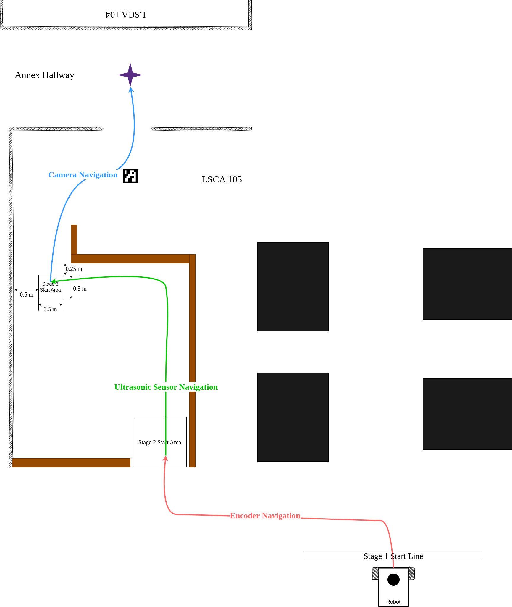

# Final Project: Multi-Sensor Navigation

## Background
Robotic navigation is all about moving a robot from a location, A to another location, B. Navigation is an essential functionality for any mobile robot (e.g. [Warthog](https://youtu.be/GAveEaNZZZE?si=BLWMSZ36F_Ti4tfm), [Roomba](https://youtu.be/CvZTF6YNZUw?si=JsgiMpYMYitBodM5), [Proteus](https://youtu.be/LUnZXBL_lqA?si=6UPZwneYxQJavZvq), [custom robot](https://youtu.be/jkoGkAd0GYk?si=mJk2F5EOqjExs9uL), etc.). To achieve autonomous navigation, some robots rely on complicated mathematical models, and some require fine maps. The robots we have built can also achieve some navigation tasks without these complicated tools. In this project, we will navigate our robots through out of the maze in LSCA 105 with the help from a few on-board sensors.

## Requirements:
Your robot needs to autonomously navigate out of the LSCA 105. The navigation is broken down into 3 stages. In each stage, the robot relies on one or two sensors to make right movement.
1. Encoder navigation: only the encoders are allowed.
2. Ultrasonic sensor navigation: ultrasonic distance sensor is allowed while the encoders are optional.
3. Camera navigation: camera is allowed while other sensors are optional. Human aids are expected.

### (60%) Coding and Demonstration:
- Please upload your code to this repository. You may have multiple scripts to upload, so using the [`scripts`](scripts/) directory is recommended.  
- (20%) Stage 1 - Navigation with encoders:
    - **Start the robot on or behind the "Stage 1 Start Line"**.
    - You may need to plan a good trajectory first.
    - Calculate encoder counts based on planned trajectory.
    - (5%) **Stop at the "Stage 2 Start Area" in the end**.
    - Refer to [Assignment 5](https://classroom.github.com/a/uDp43j74).

- (20%) Stage 2 - Navigation with ultrasonic sensor:
    - You may want to guide your robot based on its distance to the walls.
    - You can use encoders to make your robot to go straight and turn specific angles. However, you **CANNOT** rely on the encoders to make your robot travel for a specific distance.
    - (5%) **Stop at the "Stage 3 Start Area" in the end**.
    - Refer to [Assignment 4](https://classroom.github.com/a/MRtWIxLi).

- (20%) Stage 3 - Navigation with camera:
    - Guide your robot with an ArUco marker.
    - You'll need to set up communication between Pi and Pico.
    - (5%) **Stop within 1 meter radius to the goal**.
    - Refer to Robotic Vision [slides](https://linzhanguca.github.io/_docs/robotics1-2024/1105/vision.pdf).

- Miscellaneous:
    - For the demonstration, each individual has 5 attempts.
    - Only one LED is required (you pick color). Turn it on when any motor is spinning. Turn it off if robot is fully stopped.
    - You can recruit buttons, but they are just optional. 

#### Helpful Resources:
- [Need RPi to Pico communication?](https://github.com/linzhangUCA/3421example-communicate)
- [Need to drive and monitor motors?](https://github.com/linzhangUCA/3421example-motor_drivers)
- [Need the latest base design with PCB compatibility?](https://github.com/linzhangUCA/homer/blob/main/homer_description/designs/homer_v6.FCStd)
- [Need to figure out Pico's wiring on the PCB?](images/pico_wiring.png)
- [Need to jump connect PCB to the motor driver?](images/pcb_wiring.png)

### (40%) Documentation
Complete the following sections in this [README](/README.md) file.

1. (5%) Part List Table
   - List the names of all the physical components used for this project.
   - Describe the **functionalities or key specifications** of the corresponding components
   - Specify quantities of the components used.
2. (5%) Wiring Diagram
   - Illustrate your power management.
   - Illustrate control signal wiring. 
3. (10%) Mechanical Layout Diagram
   - Illustrate shapes of key components (It is OKAY to use rectangles for circuit boards).
   - Illustrate dimensions of key components.
   - Specify locations and orientations of key components.
   - **Denote the entities for the Approach section with appropriate symbols.** 
4. (20%) Approach
   1. Describe how to calculate an encoder's pulses counts given wheel's travel distance (in meters).
   2. Describe how to compute encoders' pulses counts, repectively, given the robot's spinning angle (in radians) around the center of its driving axle.
   3. Please state whether above two problems are kinematics, or statics or dynamics problems.
   4. Describe/Illustrate your control strategy for the third navigation stage. Software flowcharts are welcome.
  
#### Helpful Resources:
- [Need to express math equations?](https://docs.github.com/en/get-started/writing-on-github/working-with-advanced-formatting/writing-mathematical-expressions)
  
#### Part List Table
> Please refer to the [table formatting guide](https://docs.github.com/en/get-started/writing-on-github/working-with-advanced-formatting/organizing-information-with-tables)

| Name | Description | Quantity |
| :--- | :---        |  :---:   |
|      |             |          |
|      |             |          |

#### Wiring Diagram
> Please refer to the [image insertion guide](https://docs.github.com/en/get-started/writing-on-github/getting-started-with-writing-and-formatting-on-github/basic-writing-and-formatting-syntax#images)

#### Mechanical Layout Diagram
> Please refer to the [image insertion guide](https://docs.github.com/en/get-started/writing-on-github/getting-started-with-writing-and-formatting-on-github/basic-writing-and-formatting-syntax#images)

#### Approach
> Please refer to the [Math expression guide](https://docs.github.com/en/get-started/writing-on-github/working-with-advanced-formatting/writing-mathematical-expressions).
